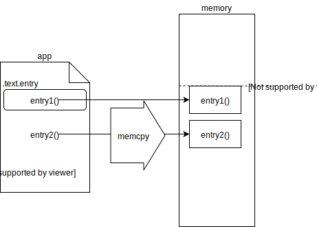

paging/021: 簡単なローダ
==========================

今回使用するディレクトリ：[sample/paging/021](https://github.com/PFLab-OS/Toshokan/tree/master/sample/paging/021)

Attention: 今回の内容はページングとは直接関係ありませんが、次回以降のソースコードを理解する上の参考になるので解説しています。

今回は簡単なプログラムローダを記述します。

プログラムローダとは、プログラムの実行ファイルをファイルフォーマットに則って解釈し、メモリ上に適切に展開してプログラムが実行できるようにするための物です。例えば、Windowsの実行ファイルは[PE](https://ja.wikipedia.org/wiki/Portable_Executable)と呼ばれるフォーマットになっていますし、Linuxの実行ファイルは[ELF](https://ja.wikipedia.org/wiki/Executable_and_Linkable_Format)と呼ばれるフォーマットになっています。これらの実行ファイルはそのままメモリにコピーしても実行できません。そこで、ファイルフォーマット内に書かれている「どのデータをどのメモリアドレスに配置するか」という情報を基に、データを再配置する必要があります。この再配置を行うプログラムがプログラムローダです。

ただし今回はあくまでページングの説明に使用するための物なので、実行ファイルをセクション毎に再配置するといった複雑な機能は実装しません。単にバイナリファイルを適切なメモリアドレスにメモリコピーするだけです。

ロード対象のアプリケーションについて
------------------------------
ロード対象のアプリケーションのソースコードは[app1.cc](https://github.com/PFLab-OS/Toshokan/blob/master/sample/paging/021/app1.cc)です。app1.ccが行いたい処理は、entry1()で[iに1を代入](https://github.com/PFLab-OS/Toshokan/blob/master/sample/paging/021/app1.cc#L7)し、entry2()で[iをインクリメントする](https://github.com/PFLab-OS/Toshokan/blob/master/sample/paging/021/app1.cc#L13)という処理です。ただし、entry1()とentry2()の間でコンテキストスイッチ（後で解説）します。

ローダへのapp1の組込み
------------------------------

app1.ccは[コンパイルされるとapp1という実行ファイル](https://github.com/PFLab-OS/Toshokan/blob/master/sample/paging/021/Makefile#L10-L11)となり、[バイナリデータを格納したオブジェクトファイルに変換](https://github.com/PFLab-OS/Toshokan/blob/master/sample/paging/021/Makefile#L13-L14)され、[ベアメタルプログラムに組み込まれます](https://github.com/PFLab-OS/Toshokan/blob/master/sample/paging/021/Makefile#L16)。ベアメタルプログラムからはバイナリデータに[配列としてアクセス](https://github.com/PFLab-OS/Toshokan/blob/master/sample/paging/021/friend.cc#L9-L10)する事ができます。これを利用して、friend.cc内のコードがapp1をロードします。

Note: 皆さんにとってのプログラムローダは、実行ファイルをファイルシステムから読み、それをメモリ上に展開する、という物かもしれません。その意味では、ロード対象のプログラムをローダに組み込んでしまうのは少し奇異に見えるでしょう。しかしファイルシステムから実行ファイルを読むのは、汎用PCにおいて「ユーザーがファイルシステム上にあるファイルを実行したい」という要求があるからです。
もしロード対象のプログラムが決まっているのであれば、プログラムローダとロード対象のプログラムをひとまとめにしておく事で、わざわざファイルシステムからファイルを読む必要が無くなります。ファイルシステムの無い環境（我々のベアメタルプログラムや一部の組込み環境等）において、この手法はとても有用です。（ファイルシステムをゼロから作らなくて良いので！）

app1のメモリへの展開
-------------------------------

実行ファイルapp1はメモリアドレス0x400000からの領域に展開されば上手く動くよう、[リンク時のアドレス設定](https://github.com/PFLab-OS/Toshokan/blob/master/sample/paging/021/app1.ld#L4)をしています。最初に実行される関数（いわばmain関数のような物）であるentry1()はコンパイル時に[.text.entryというセクションに配置し](https://github.com/PFLab-OS/Toshokan/blob/master/sample/paging/021/app1.cc#L3)ます。.text.entryセクションはリンク時に[バイナリの先頭に配置されます](https://github.com/PFLab-OS/Toshokan/blob/master/sample/paging/021/app1.ld#L6)。.text.entryセクションがentry1()のみであれば、entry1()は0x400000からの領域に展開されるはずなので、アドレス0x400000にジャンプするとentry1()が実行される事になります。

ローダについて
------------------------------
friend.ccがプログラムローダとして行っている役割は２つあります。

* app1のロード
* app1へのジャンプ

前者は[0x400000ULにバイナリをメモリコピーする](https://github.com/PFLab-OS/Toshokan/blob/master/sample/paging/021/friend.cc#L11)だけです。後者は、まずエントリポイントを[0x400000ULに設定し](https://github.com/PFLab-OS/Toshokan/blob/master/sample/paging/021/friend.cc#L14)、関数ポインタを用いて[そこにジャンプ](https://github.com/PFLab-OS/Toshokan/blob/master/sample/paging/021/friend.cc#L17)しています。

Note: きちんとしたプログラムローダではスタックの切り替えもローダの重要な仕事ですが、今回は必要無いので割愛しています。

簡単なコンテキストスイッチ
------------------------------
app1はentry1()とentry2()の間で簡単なコンテキストスイッチを行います。コンテキストスイッチとは、実行中のプログラムの状態（コンテキスト）を一時的に保存し別の処理に切り替え（スイッチ）る事で、これによって別のタスクへの切り替え、つまりマルチタスクを実現する事ができます。

汎用OSにおいてはコンテキストスイッチがプリエンプティブに行われます。即ち、プログラムの協力が無くともOSが自由にプロセスを中断したり、再開する事ができます。これを実装するためにはハードウェアによる補助が不可欠なので、どうしても実装が複雑になってしまいます。今回はページングの説明のために用いるので、そこまでは実装しません。なので、app1.ccは自力でプログラムの状態、つまりコンテキストを保存しています。

コンテキストスイッチする際には、プログラムの実行継続に必要な全ての情報と、実行を再開するアドレスを保存しなければなりません。entry1()を終了してコンテキストスイッチするためには、iという変数と、再開先であるentry2()のアドレスを保存しておかなければならないわけです。これらを保存するために[Context構造体](https://github.com/PFLab-OS/Toshokan/blob/master/sample/paging/021/app.h#L2)を作りました。entry1()のreturn時に、[全ての情報が代入されたContext構造体を返しています](https://github.com/PFLab-OS/Toshokan/blob/master/sample/paging/021/app1.cc#L9)。

Note: 一般的なノンプリエンプティブマルチタスクOSは、コンテキストスイッチしたい場所（関数の途中）で呼び出すためのシステムコールを提供しています。Linuxの例を上げれば、関数の途中で`sleep(10)`とすると10秒間プログラムが停止し、裏で別のプロセスが（もし存在すれば）実行されますよね。このような方式はプログラムがとても書きやすいのですが、OS側はシステムコールが発行された時にスタックを保存しなければいけません。スタックを保存するコードは少し難しいので、今回はそのような手法は取らず、「関数からreturnするとコンテキストスイッチ、保存したい状態はContext構造体に明示的に格納する」という方法を採用ました。この方法はOSによるコンテキストスイッチとしてはあまり一般的ではないのですが、プログラムの状態を保存し、切り替えるというコンテキストスイッチの概念自体は十分に実現できています。

Note: 実は変数iについては、Context構造体に保存せずとも、グローバル変数を用いる事でentry1()とentry2()の間で値を受け渡す事が可能です。しかし今回はiの値をfriend.ccから監視したいので、敢えてContext構造体にiを格納する事にしました。

entry1()から返されたコンテキストは、[friend.ccが受け取り](https://github.com/PFLab-OS/Toshokan/blob/master/sample/paging/021/friend.cc#L17)、[実行を再開する際に渡されます](https://github.com/PFLab-OS/Toshokan/blob/master/sample/paging/021/friend.cc#L24)。

コンテキストが引き継がれている事の確認
------------------------------

コンテキストスイッチ時にきちんとコンテキストが保存されている事も確認しましょう。app1.ccは、entry1()で変数iに1を代入し、entry2()でiをインクリメントするので、最終的にiの値は2になるはずです。

まず、コンテキストスイッチ時に[iが1がどうかを検査](https://github.com/PFLab-OS/Toshokan/blob/master/sample/paging/021/friend.cc#L25)します。次に、entry2()の実行終了時に[iが2になっているか検査](https://github.com/PFLab-OS/Toshokan/blob/master/sample/paging/021/friend.cc#L36)します。もしもiが期待と違う場合は、`return_value(1)`を用いて、プログラムをFAILUREさせます。

実行してみよう！
------------------------------

説明がだいぶ長くなってしまいました。このコードを実行してみてください。きちんとapp1がロードされ、コンテキストを引き継いだままコンテキストスイッチできるでしょうか？

上手く動いたら、`hello!`>>>（iの値の遷移）>>>`bye!`と出るはずです。

Hint: 今回、プログラムローダとコンテキストスイッチについて説明しましたが、今回はあくまでページングの説明に繋げる事が目的なので、どちらも非常に簡略化しています。一般的なプログラムローダやコンテキストスイッチの話はそのうち別の章で解説する予定なので、そちらを参考にしてください。

[このセクションの目次に戻る](index.md)
