paging/031: ページテーブル
==========================

今回使用するディレクトリ：[sample/paging/031](https://github.com/PFLab-OS/Toshokan/tree/master/sample/paging/031)

いよいよ今回からページングの仕組みを学んでいきましょう。皆さんに手を動かしてもらう部分もありますが、面倒くさがらず是非手元で試してみてください。

割り当たっている仮想メモリはどこまで？
---------------------------------

まずはサンプルコードを`make`してみてください。`hello!`と表示された後に`bye!`と表示されましたか？

では次に、[この行](https://github.com/PFLab-OS/Toshokan/blob/master/sample/paging/031/friend.cc#L30)を見てください。仮想メモリ0xC0000000からの4byte（int型のポインタにキャストしているため）に0を書き込んでいます。この0xC0000000を0xD0000000に書き換えてみるとどうなるでしょうか？試してみてください。

仮想メモリ0xC0000000へのマッピングは[ここ](https://github.com/PFLab-OS/Toshokan/blob/master/sample/paging/031/friend.cc#L26-L28)で行っています。このマッピングが何を意味するのか調べてみる、というのが今回の趣旨です。

といっても、ここまで学んできた皆さんならコード読んだだけである程度察しがつきますよね。pt1[0]への書き込みが4KBのメモリ割り当てを意味し、for文でiを0から1023までインクリメントするから、最後のループではpt1[1023]が設定される。つまり4KB×1024だけのメモリが割り当てられる、と考えたのではないでしょうか？

4KB×1024は4MBです。仮想メモリ0xC0000000に4MBを足したアドレスは0xC0400000ですね。という事は0xC0400000の直前まではアクセスできそうな気がします。0xC0400000からint型のサイズである4を引いて、0xC03FFFFCにアクセスしてみましょう。試してみてください。

おっと、想定していたのと違う結果になってしまいましたか？これは仮想メモリ0xC03FFFFCに物理メモリが割り当たっていない事を意味しています。我々は4MBのメモリが割り当たっていると予想しましたが、どうやら4MBではないみたいですね。実際には何MB割り当たっているのでしょう？0xC0000000から0xC03FFFFCのどこかに「物理メモリが割り当たっている領域と割り当たっていない領域の境目」が存在するはずです。探してみましょう。

境目のアドレスは何だったでしょうか？そしてそこは0xC0000000から何MBだったでしょうか？もう少し考察してみましょう。サンプルコードではfor文を1024回回してpt1が指すメモリ領域を設定したわけですが、1024回設定してもメモリは4KB×1024分は設定されませんでした。実際に設定されていたメモリは4KB×何個分だったでしょうか？

ページとページテーブル
---------------------------------
pt1が指しているのは、仮想メモリの[0x314000](https://github.com/PFLab-OS/Toshokan/blob/master/sample/paging/031/friend.cc#L14)です。先程の実験から、pt1を設定する事によって4KB×512だけの物理メモリを割り当てられる事がわかりました。つまり、0x314000からuint64_t（[pt1の型はuint64_t×型](https://github.com/PFLab-OS/Toshokan/blob/master/sample/paging/031/friend.cc#L14)）512個分の領域が仮想メモリと物理メモリの割り当てを設定できる事が分かります。

ここで一つ言葉の定義をしておきましょう。仮想メモリと物理メモリの割り当ては4KBごとに行うというのは皆さん既にご存知の通りだと思いますが、この4KB（4096byte）を「ページ」と呼びます。ここで注意すべき事として、4KBのメモリ領域を何でも「ページ」と呼ぶわけではありません。ページの先頭アドレスは4096で割り切れる場所となっています。つまり「ページの先頭は4096でアラインされている」必要があります。

さて、pt1について振り返ってみましょう。先程、メモリ割り当てるできる領域はuint64_tが512個分だと書きました。uint64_tは64bit型、つまり8byteなので、512×8byte=4096byteという事になります。pt1のアドレスは0x314000ですから4096byteでアラインされていますね。どうやらこの領域もまた「ページ」のようです。

この物理メモリと仮想メモリの対応付けを設定するページには特別な名前がついており、「ページテーブル」と呼ばれています。「ページの先頭アドレスを512個列挙するテーブル」と考えると理解しやすいかもしれません。

ページテーブルによるマッピング
---------------------------------

今回のコードにおけるページテーブルの物理メモリと仮想メモリの対応関係を図式化すると、以下のようになります。

ここで大事なのは、ページテーブルのインデックス（何番目のエントリか）と仮想メモリの番地は１対１に対応している一方、ページテーブルに書き込まれている物理アドレスを書き換える事で自由な物理メモリを指し示す事ができる、という事です。

なので、例えばこんな感じの対応関係でも良いわけですね。

一方で、このように仮想メモリとページテーブルのエントリを自由に紐つける事はできません。

理解度テスト
---------------------------------

Q. アドレス0x40100はページの先頭でしょうか？
[gimmick:question({ answer: 1, list: ["先頭である", "先頭でない"]})]()

Q. ページテーブルは4096byteでアラインされている必要が
[gimmick:question({ answer: 0, list: ["ある", "ない"]})]()

[このセクションの目次に戻る](index.md)