paging/032: 多段階ページング
==========================

今回使用するディレクトリ：[sample/paging/032](https://github.com/PFLab-OS/Toshokan/tree/master/sample/paging/032)

隣の2MB
---------------------------------
前回、仮想メモリ0xC0000000からの2MBに物理メモリを割り当てる方法を考えました。では、0xC0200000（0xC0000000に2MBを足したアドレス）からの2MBにはどうやって物理メモリを割り当てれば良いのでしょう？

ページングの設定をした上で、[0xC0200000にアクセス](https://github.com/PFLab-OS/Toshokan/blob/master/sample/paging/032/friend.cc#L33)するコードを書いてみました。まずはこのコードがきちんと動作するか、皆さんの方でも試してみてくださいね。

このコードで仮想メモリ0xC0200000にアクセスした時、実際にアクセスされる物理メモリは0x80700000です。そしてその設定をしているのは、[この行](https://github.com/PFLab-OS/Toshokan/blob/master/sample/paging/032/friend.cc#L31)になります。0x80700000ULという値がありますね。

なぜこのpt2[0]を設定すると仮想メモリ0xC0200000からの4KBが設定されるのでしょうか？pt2を参照している場所を探してみると、[こんな行](https://github.com/PFLab-OS/Toshokan/blob/master/sample/paging/032/friend.cc#L21)が見つかります。これはpd2[1]にpt2の物理メモリを設定しているコードです。（なぜpt2+0x80000000ULがpt2の物理アドレスなのかは、今は説明を割愛させてください。ごめんなさい）[上の行](https://github.com/PFLab-OS/Toshokan/blob/master/sample/paging/032/friend.cc#L20)では、pd2[0]にpt1の物理メモリを設定していますね。どうやらこの辺りに答えがありそうです。

ページディレクトリ
---------------------------------
答えから書くと、このコードにおいて、仮想メモリ0x313000からの4KB（正確には、0x313000からの4KBの仮想メモリに対応する、4KBの物理メモリ）はページディレクトリと呼ばれる領域になっています。ページディレクトリには、ページテーブルを512個設定する事ができます。

ページテーブルの構造を思い出してみてください。ページテーブルはページを512個設定する事ができましたよね。ページテーブルとページディレクトリは似たような構造になっているわけです。

ここで前回の復習をしましょう。ページテーブルの第０エントリ、pt1[0]にページの物理アドレスを設定する事で、その物理ページ（物理メモリ上のページ）と0xC0000000からの仮想ページ（仮想メモリ上のページ）が対応づけられました。次にpt1[1]を設定すると、0xC0001000からの仮想ページを設定する事ができました。つまり、pt1[i]（ただし、iは512以下）を設定すると、0xC0000000 + i × 0x1000からの仮想ページを設定する事ができるわけです。このようにしてpt1は0xC0000000から0xC0200000までの2MBの仮想メモリ空間の割り当てを管理していると言えるでしょう。

ページディレクトリの場合を考えてみましょう。pd2[0]にpt1の物理アドレスを設定すると、pt1が0xC0000000から2MBの仮想メモリを管理できるようになります。そしてpd2[1]にpt2の物理アドレスを設定すると、pt2が0xC0200000から2MBの仮想メモリを管理できるようになります。つまりpd2[i]（ただし、iは512以下）には、0xC0000000 + i × x0200000からの2MBの領域を管理するページテーブを設定できます。

言い方を変えると、ページディレクトリpd2は0xC0000000からの2MBがどのページテーブルで管理されるか、0xC0200000からの2MBがどのページテーブルで管理されるか、といった情報を管理しているわけです。そしてページテーブルpt1が0xC0000000からの4KBがどのページに割り当たっているか、0xC0001000からの4KBがどのページに割り当たっているか、といった情報を管理しているわけですね。

PDPTとPML4TとCR3レジスタ
---------------------------------
ページディレクトリpd2がページテーブルを管理している事はわかりました。それではページディレクトリはどうやって管理されているのでしょうか？ソースコードを追いかけてみましょう。

pd2は[pdptという配列から参照され](https://github.com/PFLab-OS/Toshokan/blob/master/sample/paging/032/friend.cc#L19)、pdptは[pml4tという配列から参照され](https://github.com/PFLab-OS/Toshokan/blob/master/sample/paging/032/friend.cc#L17)ています。そしてPML4T自体は[インラインアセンブリによってCR3レジスタに代入されて](https://github.com/PFLab-OS/Toshokan/blob/master/sample/paging/032/friend.cc#L26)います。

PDPTとPML4Tはページディレクトリと同じ構造になっています。つまり大きさは4KBで、512個のエントリを格納しています。PML4TはPDPTを管理し、PDPTはページディレクトリを管理します。図にしてみましょう。

CR3はPML4Tを参照するための専用のレジスタ（RAXやRBXといった汎用用途のレジスタではなく、用途が決まったレジスタ）で、CR3を起点としてPML4TやPDPT、ページディレクトリ、ページテーブルを参照します。

詳しくは次回説明しますが、なぜpt1が0xC0000000からの4KBを管理するのか、そしてpd2が0xC0000000からの2MBを管理するのかは、CR3からPML4TやPDPTを辿る事によって決定される事になります。

階層型ページング管理の利点
---------------------------------
ここまで見てきたように、x86のページングは階層構造で管理されています。でも正直、階層構造になっているのって結構複雑ですよね？なんでこのような構造になっているのでしょうか？

階層構造でなかったらどうなるのか、考えてみましょう。x86はページテーブルのエントリ数が512ですが、仮にこれを262144にしてみましょう。代わりに、ページディレクトリやPDPT、PML4Tは存在せず、CR3レジスタが直接ページテーブルを指す事とします。各々のエントリには4KBページを指定できるので、262144×4KB=1GBの仮想メモリを管理できる事となります。この時のページテーブルの大きさはいくらになるでしょうか？各々のエントリサイズがx86と同様8byteとすると、250000×8byte=2MBとなります。

さて、ここで大事なのは「プログラムの中には沢山メモリを使う物もあれば、少ししか使わない物もある」という事です。プログラムが4KBしかメモリを使わないなら、このページテーブルのエントリの殆どは空になります。プログラムが使うメモリが4KBなのに、物理メモリと仮想メモリの対応表が2MBも使うのは無駄だと思いませんか？

そこで、ページディレクトリとページテーブルのみの２段階のページング構造を考えてみましょう。それぞれ512エントリとします。

ページテーブルが4KB×512=2MBの領域を管理し、ページテーブルが2MB×512=1GBを管理できるので、使える仮想メモリのサイズは1GBのままですね。プログラムがメモリを4KBしか使わない時、管理にはページディレクトリとページテーブルがそれぞれ1つづつ必要なので、4KB×2=8KBのメモリを使う事になります。プログラムが4KBしか使わないのに、ページングのために8KB必要なのはやはり無駄が多いような気もしますが、少なくとも2MBよりはだいぶマシになりましたね。

結論としては、階層型ページングを使う事で、ページテーブル等のページングに必要なメモリを削減できる、という事です。もちろん、これはプログラムがメモリをあまり消費していない時に限った話です。上の例でプログラムが1GB全てを使う場合、当然ページテーブルは512個必要となるのでページテーブルのためのメモリが沢山必要になります。とはいえこの場合、プログラムが使用する1GBと比較すれば、ページングのためのメモリは大した容量ではないのですが。

こう書くと「もっとエントリ数を減らして階層化を進めれば、もっとメモリを節約できるのでは？」なんて思う方もいるかもしれませんね。確かにそれは正しいのですが、階層が増えれば増えるほど複雑さが増し、プログラムの実行時間を低下させてしまうのですが、その話は次回にしましょう。

理解度テスト
---------------------------------

Q. CR3レジスタがPML4Tでなくページテーブルを指すようなアーキテクチャを考えてみましょう（大きさやエントリ数等はx86と同じままで）。このアーキテクチャの仮想メモリの大きさはどれくらいになるでしょうか？
[gimmick:question({ answer: 2, list: ["4KB", "1MB", "2MB", "512MB","1GB","4GB"]})]()

Q. CR3レジスタがPML4Tでなくページディレクトリを指すようなアーキテクチャの場合はどうでしょうか？
[gimmick:question({ answer: 4, list: ["4KB", "1MB", "2MB", "512MB","1GB","4GB"]})]()

Q. CR3レジスタがPML4TでなくPDPTを指すようなアーキテクチャの場合はどうでしょうか？
[gimmick:question({ answer: 4, list: ["512MB","1GB","64GB","256GB","512GB","1TB"]})]()

[このセクションの目次に戻る](index.md)
