paging/035: ヒュージページ
==========================

今回使用するディレクトリ：[sample/paging/035](https://github.com/PFLab-OS/Toshokan/tree/master/sample/paging/035)

連続してマップする
---------------------------------
ページングの一番のポイントは、「4KB単位のページで管理する」事でした。これによって「仮想メモリ上は隣同士のページが、物理メモリ上は隣同士でなくても良い（＝メモリの断片化）」とか、「使用していない領域のページは解放する（＝物理メモリは虫食い状に割り当たっている）」といった事ができるわけです。

しかし、もし仮にこれらのページングの機能を有効活用できないような状況が発生したらどうなるでしょうか？有効活用できない状況というのは、上の例の真逆をやれば良いわけですから、「連続した物理ページを割り当てる事ができて、かつその連続領域全てを使用するような」時です。例えば、2MBくらいのデータをファイルから読み込んで処理する、みたいな場合を考えてみましょう。2MBのデータを一気にメモリ上に展開するので、連続した物理ページを割り当てる事ができますし、そのデータ全てに等しくアクセスする事になりそうです。

このような状況でページテーブルがどうなるか、考えてみましょう。（下の図ではPML4TとPDPTを省略しています）

データの展開先が2MBにアラインされている場合だけですが、上の図のpt1のように、ページテーブルエントリ0〜511まで、0x80800000から順番に4KBづつ割り当てる事になります。

これって凄い無駄だと思いませんか？ページテーブルの利点を一切使いこなせていません。わざわざページテーブルを構築しなくても、ページディレクトリの第０エントリに「このエントリが管理している2MBは物理メモリ0x80800000からの2MBと対応づづいている」と書いてしまった方が楽ですよね。

ヒュージページ
---------------------------------

これを実現するのが「ヒュージページ」と呼ばれる機能です。[Intel SDM](/document.md#Intel%C2%AE_64_and_IA-32_Architectures_Software_Developer%E2%80%99s_Manual)`Vol.3`, `4.5 4-LEVEL PAGING`, `Table 4-17. Format of a 4-Level Page-Directory Entry that Maps a 2-MByte Page `にある通り、第7bitを立てるとヒュージページが有効化され、「ページディレクトリが2MBの巨大なページを管理している」と見なす事ができるようになります。

もちろん、この2MBの巨大なページは2MBにアラインされている必要があります。2MBにアラインできない場合は、ページテーブルを用いてマップしなければなりません。

上で紹介したヒュージページはページディレクトリのヒュージページでしたが、PDPTにもヒュージページが存在します。ページディレクトリと同様、PDPTは直接ヒュージページを参照する事になります。PDPTが参照するヒュージページのサイズがいくらになるか、理解度テストで出題したので、考えてみてください。「ページディレクトリの全てのエントリが連続した物理メモリ領域を指している」状況を考えると、答えが導けるはずです。

実際に試してみる
---------------------------------
サンプルコードを見てみましょう。今回はpt2を使わず、[pd2にヒュージページを設定して](https://github.com/PFLab-OS/Toshokan/blob/master/sample/paging/035/friend.cc#L20)います。[前回のコード](https://github.com/PFLab-OS/Toshokan/blob/master/sample/paging/032/friend.cc#L21)とも比べてみてください。

また前回と同様、[0xC0200000に0を書き込んで](https://github.com/PFLab-OS/Toshokan/blob/master/sample/paging/035/friend.cc#L31)います。ヒュージページの設定が上手くいっていれば、きちんと動くはずですが・・・。結果は皆さんの手元で試してみてください。

ヒュージページのメリットとデメリット
---------------------------------

ヒュージページには利点と欠点があります。これまでの内容を踏まえれば分かると思うのですが、どうでしょうか？皆さんも少し考えてみてください。

欠点としては、メモリが無駄になってしまうかもしれない事です。2MBヒュージページの場合、本当に2MB全てを参照するのであればヒュージページの方が良いのですが、1MBまで読んだ所で「残りの1MBは参照しなくて良いや」となってしまうかもしれません。そうなると普通の4KBページを使っておけば良かった、となってしまいます。なのでヒュージページをどこで使うかは、アプリケーションのアルゴリズムと密接に絡む非常に難しい問題です。

利点としては先程も挙げた通り、2MBを全てを参照するような場合にページテーブルの4KB分を節約できる事です。そして何よりページ構造の参照回数が一回減るので、アドレス変換のコストを下げる事ができます。参照回数が一回減る事は些細な事のようにも思えますが、一部のアプリケーション（広帯域ネットワーク通信等）においては、性能向上のために積極的に使われているようです。

コードを振り返ってみよう
---------------------------------

[paging/031](031.md)から一通りx64のページング機構の仕様を説明してきましたが、皆さんいかがだったでしょうか？ついてこれましたか？

もう今の皆さんなら、[説明を飛ばしていた部分](https://github.com/PFLab-OS/Toshokan/blob/master/sample/paging/035/friend.cc#L10-L30)のコードが理解できるはずです。練習問題として、この部分がどのようなページマップをしているか、皆さん自身で調べてみてください。

おっと、最後に一つだけ説明しておかなければいけない事があるんでした。ページディレクトリpd2にページテーブルpt1の物理アドレスを設定する時、何時も`pt1 + 0x80000000UL`としていましたよね。これはmain関数が実行される前に、仮想メモリ0x00000000〜の1GBが、物理アドレス0x80000000からの1GBと対応するようにページテーブルを初期化しているからです。つまり、main関数の実行時点で既にページングが使われているわけです。

このページングの設定は、[Toshokan](https://github.com/PFLab-OS/Toshokan)と言う、私が作っているベアメタルプログラムを簡単に実行できる仕組みによって実現されています。もし皆さんが本当のベアメタルプログラムを書く場合は、ページングの有効化等から始めなければなりません。その点は注意してくださいね。（このドキュメントはページングの本質を皆さんに理解してもらう事が目的なので、ページングの有効化手法について詳しい事は解説しません。興味がある人は、[OSDev.org](https://wiki.osdev.org/Setting_Up_Long_Mode)等を参考にしてみてください）

理解度テスト
---------------------------------

Q. PDPTのエントリに設定できるヒュージページの大きさは幾つでしょう？
[gimmick:question({ answer: 2, list: ["2MB", "512MB", "1GB", "2GB", "4GB"]})]()

[このセクションの目次に戻る](index.md)
