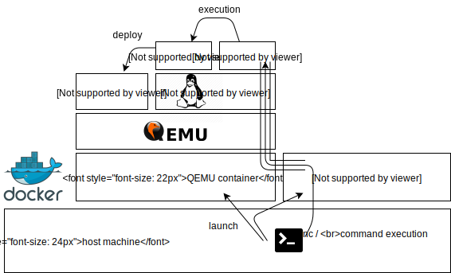

# Makefileの解説

## Makefile
Makefile自体は非常にシンプルです。toshokan_toolsという名前のdockerイメージからbuild_rules.mkやその他のラッパースクリプト（後述）を.misc以下へコピーした後、.misc/build_rules.mkを呼び出す、というものです。

これによって、ユーザーが複雑なビルドルールを記述、管理せずにToshokanアプリをビルドできます。また、変数TOSHOKAN_VERSIONを変更するだけで、そのバージョンに応じたビルドスクリプトを自動でダウンロード、実行するようになっています。

## binutils
build_rules.mkの解説に入る前に、`.misc/wrapper`以下の各実行形式ファイルについて解説します。

これらの実行形式ファイルの実体はシェルスクリプトで、binutils系ツールを容易にコンテナ内で実行するためのラッパーです。各種binutilsツールがコンテナ内で実行される事で、ホストのパッケージ依存性を廃し、またLinux以外の環境のサポートを可能にしています。各々のスクリプトは`base`を呼び出すようになっており、`base`が実際のコンテナの起動を行います。

機能としては、Linuxにおけるbinutilsコマンド群とほぼ等価です。

## コンパイル

コンパイルはbuild_rules.mk内で実行されます。全ステップにおいて、`.misc/wrapper`以下のラッパースクリプトを用います。（即ち、コンテナ内で全て処理されます）

1. friendバイナリのコンパイル
1. friendバイナリをhakaseバイナリへ埋め込むためにオブジェクト化
1. friendバイナリからシンボルテーブルを抽出し、symファイル化
1. 上記３つとhakaseソースコードを合わせてhakaseバイナリを作成

hakaseバイナリにはfriendバイナリが埋め込まれており、hakaseバイナリ単体だけで、friendバイナリのロードと起動が可能です。

## 実行
1. コンテナ間ネットワークを作成
1. QEMUコンテナを作成、QEMU（仮想マシン）を起動
1. QEMU上のLinuxのrsyncサーバーの準備が完了するまで待機
1. hakaseバイナリをQEMU上のLinuxへrsyncで転送
1. QEMU上のLinuxへssh接続し、hakaseバイナリを起動

## サンプル
今回はディレクトリ内にサンプルを添付していません。適当なディレクトリ内のMakefileを参照してみてください。